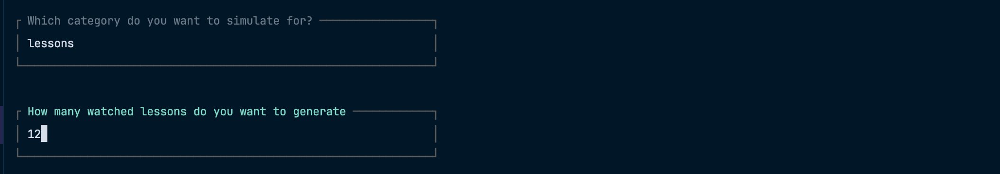

## Back-end Developer Test

### Run the following commands to set up the app

```
composer install

cp .env.example .env

php artisan key:generate

```

### Run the command below to run migrations and seed data into the application
```
php artisan migrate --seed

```


### Run the command below to configure the application

```
php artisan  app:configure-app

```


### Run the command below to run test cases of the application

```
php artisan test

```

### Run the command below to simulate the application

```
php artisan  app:simulate-app

```



### To start the app

```yaml
php artisan serve

Test the api response at http://127.0.0.1/users/1/achievements
```

